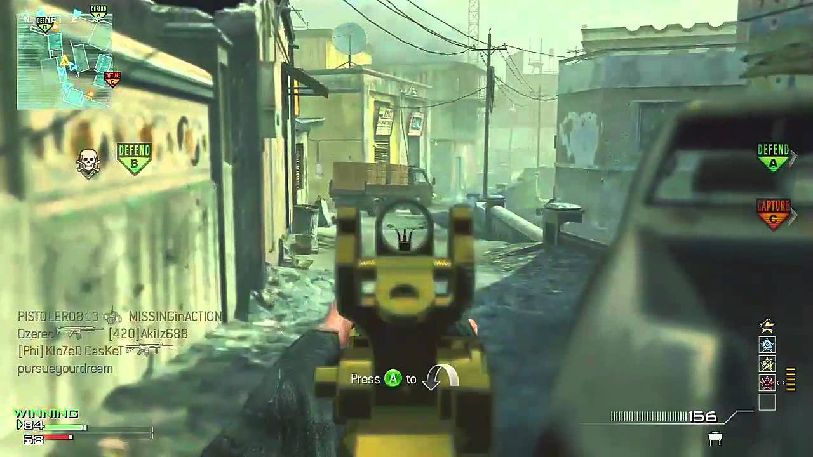

## רכיבים דינאמיים:

## המשחק שנבחר: Call Of Duty Modern Warfare 3

   

## שאלה 1:

***מאפיינים מספריים*** 
***עצם מספר 1: נשק מסוג ACR 6.8***                                                                                                                                                                          

  

    
  

## 1) כמות כדורים במחסנית: 30 כדור.
## 2) כמות מחסניות סטנדרטית: 30 מחסניות

   
תשובה:

הבחירה בנשק מסוג ACR נובעת מכך שהוא משתייך לקטגוריית Assault Rifle,
המאופיינת בגמישות גבוהה ובאיזון בין טווח, דיוק וקצב אש.
נשק זה יעיל במיוחד בטווחים בינוניים ואף ארוכים (עד כ־300 מטר),
ובו בזמן מספק מענה סביר גם למצבי קרב בטווח קצר.
שילוב זה הופך את ה-ACR לנשק ורסטילי, המתאים למגוון סגנונות משחק ולתרחישים שונים במפה.
עם זאת, כדי למנוע מצב שבו הנשק יהפוך לחזק מדי (Over Powered), מאפייניו המספריים מאוזנים כך שלא יאפילו על כלי נשק אחרים בקטגוריות שונות, 
ובכך נשמר האיזון הכללי במשחק והוגנת חוויית המשחק לשחקנים.
במידה ואכן היו משנים את כמות הכדורים לדוגמא ל-20 כלומר מפחיתים את כמות הכדורים פר מחסנית, 
כלומר נוצר קושי אסטרטגי מבחינה של סיטואציה של gunfight אל מול שני אויבים במקביל דבר שמפחית הסיכוי שניקח אותו כנשק primary.

## הגבלת כמות התחמושת:
הגבלת כמות הכדורים נועדה לגרום לשחקן לקחת בחשבון את משאב התחמושת כגורם אסטרטגי משמעותי במהלך המשחק.
מגבלה זו מחייבת את השחקן לשקול מתי לירות, 
מתי לטעון מחדש, ואיזה סגנון משחק לאמץ – אגרסיבי או הגנתי.
באופן זה, מאפיין מספרי זה משפיע ישירות על קבלת ההחלטות של השחקן, 
מעודד משחק מחושב יותר, ומוסיף עומק טקטי לחוויית המשחק.
במידה והיו מגדלים את כמות המחסניות, היה מתאפשר להשען יותר לאופן התקפי ואגרסיבי של משחק מצד השחקן, 
במצב זה הנשק היה הופך לאידיאלי בקרב שחקנים שהם חסרי סבלנות וחותרים למגע.

***עצם מספר 2: רימון דביק(semtex)***:

מאפיינים מספריים נבחרים:

כמות רימונים זמינה לשחקן

א.זמן השהיה עד הפיצוץ (Detonation Time)

ב.רדיוס נזק (Blast Radius)

ג.נזק מרבי (Maximum Damage)

הצדקה לבחירת המאפיינים:
רימון ה-Semtex הוא רימון דביק משתייך לקטוגריה הנקראת (lethal grenades), ולכן אופן פעולתו שונה מרימונים רגילים. כמות הרימונים המוגבלת (במקרה של משחק מרובה שחקנים – ערך 1)
נועדה למנוע שימוש יתר בכלי בעל פוטנציאל נזק גבוה ולהפוך את השימוש בו להחלטה משמעותית ולא אוטומטית.

זמן ההשהיה עד הפיצוץ הוא מאפיין מספרי קריטי, שכן הוא מאפשר לשחקנים אחרים להגיב, לנוע או לנסות להתרחק ממוקד הפיצוץ, ובכך נשמר איזון בין כוח הרימון לבין יכולת ההתגוננות מפניו.

רדיוס הנזק והנזק המרבי קובעים את מידת ההשפעה של הרימון על הסביבה ועל שחקנים סמוכים, ומגבילים את האפקטיביות שלו כך שלא יחליף כלי נשק ראשיים בלחימה ישירה.

השפעה על חוויית המשחק והבחירות של השחקן:
המאפיינים המספריים של ה-Semtex גורמים לשחקן להשתמש בו באופן טקטי ומתוכנן. 
השחקן נדרש לבחור את העיתוי והמיקום המתאימים להטלת הרימון, למשל כנגד אויב מחופר או במעבר צר, ולא לבזבז אותו בשימוש אקראי.
כך, הרימון משמש ככלי משלים ללחימה ולא כאמצעי מרכזי, ותורם לעומק האסטרטגי ולאיזון הכללי של המשחק.
במידה והיו משנים את המספרים כנראה שלא היינו בוחרים אחרת, כיוון שברוב המקרים רימון זה נמצא בשימוש כאשר נכנסים לקרב פנים אל פנים באזור צפוף בדרך כלל סגור בו אחד השחקנים חותך למחסה והשני זורק לידו את הרימון לכן בין אם המספרים ישתנו או לא עדיין יווצר נזק רב לאויב.

***עצם מספר 3: Slight of Hand Perk***

מאפיין מספרי נבחר:

זמן טעינה מחדש (Reload Time)

הצדקה לבחירת המאפיין:
ה־Perk Sleight of Hand משפיע באופן ישיר על זמן הטעינה מחדש של הנשק, שהוא אחד המאפיינים הקריטיים ביותר בקצב הלחימה. קיצור זמן הטעינה מאפשר לשחקן לחזור לעימות במהירות גבוהה יותר לאחר ריקון מחסנית, ובכך מקטין את חלון הפגיעוּת שבו השחקן חשוף לאויבים.

מאפיין זה חשוב במיוחד בקרבות מטווח קצר ובמצבים אגרסיביים, שבהם כל שבריר שנייה עשוי להשפיע על תוצאת הקרב.

השפעה על בחירת השחקן:
כאשר זמן הטעינה קצר באופן משמעותי, שחקנים הנוטים לסגנון משחק אגרסיבי יעדיפו לבחור ב־Sleight of Hand, משום שהוא מאפשר להם לשמור על רצף לחימה גבוה ולהימנע מנסיגה או חיפוש מחסה. לעומת זאת, שחקנים בעלי סגנון משחק זהיר או טקטי עשויים להעדיף Perks אחרים, מאחר וההשפעה של זמן הטעינה עבורם פחות קריטית.

השפעת שינוי הערך המספרי:
אם זמן הטעינה היה מתקצר בצורה מתונה בלבד, ייתכן שה־Perk היה נתפס כפחות משמעותי, וחלק מהשחקנים היו מעדיפים לבחור Perks אחרים בעלי השפעה בולטת יותר.
לעומת זאת, אם קיצור זמן הטעינה היה משמעותי מדי, הבחירה ב־Sleight of Hand הייתה הופכת לברירת מחדל, מה שהיה פוגע בגיוון הבחירות של השחקנים ובאיזון המשחקי.

לכן, הערך המספרי של זמן הטעינה נבחר בקפידה כך שישפיע על קבלת ההחלטות של השחקן, מבלי להפוך את ה־Perk לחזק מדי או הכרחי עבור כל סגנון משחק.

## שאלה 2:

***מיקומים***
## עצם מספר 1: Weapon's Armory Station:

***מדוע מעצבי המשחק מיקמו את עמדת קניית התחמושת במקום חשוף ומסוכן:***
מעצבי המשחק בחרו למקם את עמדת קניית התחמושת באזור חשוף על מנת להפוך את פעולת ההתחמשות להחלטה אסטרטגית ולא לפעולה בטוחה וטריוויאלית. מיקום זה מייצר סיכון מובנה, המחייב את השחקן לשקול מתי לגשת לעמדה, באיזה שלב של ה־Wave, והאם ברשותו הציוד המתאים להתמודד עם האיום בזמן הקנייה.
באופן זה, פעולת קניית התחמושת הופכת לחלק מהאתגר המשחקי ותורמת למתח ולקצב המשחק.

***כיצד מיקום שונה היה משפיע על בחירות השחקן:***
אם עמדת קניית התחמושת הייתה ממוקמת באזור מוגן ובטוח, השחקנים היו ניגשים אליה באופן תדיר וללא תכנון מוקדם. מצב כזה היה מפחית את חשיבות ניהול התחמושת, מצמצם את הצורך בבחירת ציוד מתאים מראש, ומקטין את העומק האסטרטגי של המשחק.
לכן, המיקום הנוכחי משפיע ישירות על הבחירות של השחקן, מעודד תכנון מוקדם, בחירה מושכלת של נשקים ו־Perks, ומחזק את חוויית ההישרדות במצב המשחק.

## עצם מספר 2: Enemy spawn points:

## מדוע מעצבי המשחק מיקמו את נקודות הופעת האויבים במיקומים קבועים ומוגדרים:
מעצבי המשחק בחרו למקם את נקודות הופעת האויבים באזורים קבועים במפה כדי לאפשר לשחקן ללמוד את דפוסי ההתקפה של האויבים לאורך הזמן. מיקומים אלה יוצרים לחץ מתמשך ומחייבים את השחקן להכיר את המפה, להבין מאילו כיוונים מגיע האיום, ולהיערך בהתאם לפני תחילת כל Wave.
באופן זה, ההישרדות אינה מבוססת רק על תגובה מהירה, אלא גם על תכנון מוקדם וידע מצטבר.

## כיצד מיקום שונה היה משפיע על הבחירות של השחקן:
אם נקודות ההופעה היו אקראיות או משתנות לחלוטין, השחקן היה נאלץ לאמץ סגנון משחק הרבה יותר תגובתי ופחות אסטרטגי. 
הבחירה במיקום עמידה, בסוג הנשק ובציוד הייתה פחות מתוכננת, והדגש היה עובר מהכרת המפה להתמודדות מיידית עם הפתעות.
לכן, המיקום הקבוע של נקודות ההופעה משפיע ישירות על בחירות השחקן ומעודד משחק טקטי ומתוכנן.

## עצם מספר 3: High Ground Areas:

## מדוע מעצבי המשחק מיקמו אזורי גובה במקומות מסוימים במפה:
אזורי גובה ממוקמים כך שיספקו יתרון טקטי לשחקן, כגון שדה ראייה רחב ויכולת לזהות אויבים ממרחק. עם זאת, אזורים אלו אינם בטוחים לחלוטין ולעיתים חשופים מכמה כיוונים או מוגבלים בדרכי מילוט.
בחירה זו של המעצבים יוצרת איזון בין יתרון לגובה לבין סיכון, ומונעת מצב שבו אזור אחד במפה יהפוך לעמדה מושלמת ללא חסרונות.

## כיצד מיקום שונה היה משפיע על הבחירות של השחקן:
אם אזורי הגובה היו מוגנים לחלוטין או קלים מאוד לשליטה, השחקנים היו בוחרים כמעט תמיד להתמקם בהם, מה שהיה מצמצם את מגוון סגנונות המשחק ופוגע באיזון.
לעומת זאת, אם אזורי הגובה לא היו קיימים כלל, המשחק היה מאבד עומק טקטי, והשחקן היה נאלץ להתמודד עם אויבים בעיקר בטווחים קצרים וללא יתרון מיקומי ברור.
לכן, המיקום הנוכחי של אזורי הגובה משפיע על הבחירות של השחקן ומעודד שקלול בין שליטה, סיכון וניידות.

## שאלה 3:

## התנהגות הדמויות הלא־אנושיות במשחק

הדמויות הלא־אנושיות במשחק פועלות על פי מערכת כללים פשוטה וברורה. כל דמות מזהה את מיקומו של השחקן, נעה בכיוון הישיר אליו, ותוקפת כאשר השחקן נמצא בטווח אפקטיבי. בנוסף, הדמויות מגיבות לגירויים בסיסיים כגון ירי, קו ראייה ומרחק מהשחקן, ללא תכנון ארוך טווח או קבלת החלטות מורכבת ברמת הדמות הבודדת.

## איך הכללים האלה גורמים להתהוות של התנהגויות מורכבות
למרות פשטות הכללים, הצטברות של מספר רב של דמויות הפועלות בו־זמנית גורמת להיווצרות של התנהגויות מורכבות ברמת המשחק הכוללת. לדוגמה, אויבים רבים המתקרבים מכיוונים שונים יוצרים לחץ מתמשך, תחושת הקפה וחסימת נתיבי תנועה של השחקן, גם מבלי שתוכננה התנהגות כזו במפורש. כתוצאה מכך, השחקן נדרש לשנות מיקום, לנהל משאבים ולבחור אסטרטגיות התמודדות שונות.

באופן זה, כללים פשוטים ברמת הפרט מובילים להתנהגות מורכבת ודינמית ברמת המערכת כולה, ומעצבים חוויית משחק מאתגרת ואינטנסיבית.

## שאלה 4: 

## האם קיימת מערכת מסחר במשחק?

ב־Survival Mode קיימת מערכת מסחר בין השחקן לבין המערכת (Armory Stations), אך אין מסחר ישיר בין שחקנים. השחקן מרוויח כסף במהלך המשחק ומשתמש בו לרכישת נשקים, תחמושת, ציוד ו־Killstreaks.

מה משמש כ״מטבע״ בעולם המשחק?

המטבע במשחק הוא כסף וירטואלי. הכסף נצבר בעיקר באמצעות:

-- הריגת אויבים

-- הישרדות ב־Wave

-- ביצועים במהלך הקרב

הכסף משמש כאמצעי מרכזי לקבלת החלטות ולניהול משאבים לאורך המשחק.

## כיצד נקבעים ההיצע והביקוש?

***ההיצע נקבע על ידי המערכת:***

   -- פריטים מסוימים, ובפרט Killstreaks, נפתחים רק החל מ־Wave מסוים

   -- זמינות הפריטים מוגבלת בפועל על ידי כמות הכסף של השחקן

***הביקוש נוצר מצד השחקן ותלוי ב:***

  -- רמת הקושי של ה־Wave

  -- מספר וסוג האויבים

ככל שהמשחק מתקדם וה־Waves קשים יותר, הביקוש ל־Killstreaks חזקים עולה.

## כיצד נקבעים המחירים בעולם המשחק?

המחירים נקבעים על ידי המערכת בהתאם ל:

  -- עוצמת הפריט והשפעתו על הקרב

  -- תרומתו לאיזון המשחקי

  -- השלב שבו הוא נפתח במהלך ההתקדמות

 ככל שה־Killstreak חזק יותר וזמין בשלב מתקדם יותר, כך מחירו גבוה יותר.
 

## השפעת הכלכלה על בחירות השחקן

הכסף המוגבל מאלץ את השחקן לבחור בין:

  -- רכישת Killstreaks חזקים

  -- קניית תחמושת וציוד

  -- שדרוג נשקים

הבחירות הכלכליות משפיעות ישירות על סגנון המשחק, קצב ההתקדמות והיכולת לשרוד בגלים הבאים.

## מודל הרווח של מפתחי המשחק

ב־MW3 אין מערכת מיקרו־תשלומים ב־Survival Mode. מודל הרווח מבוסס על:

 -- מכירת המשחק עצמו

 -- חבילות הרחבה (DLC)

